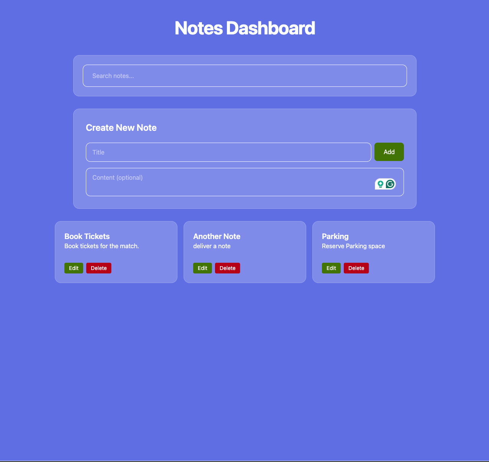
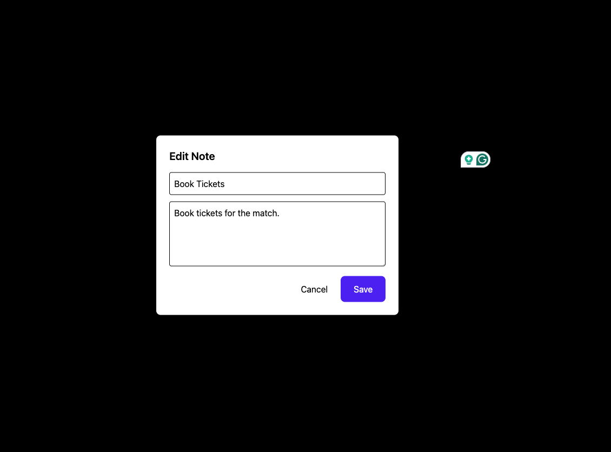
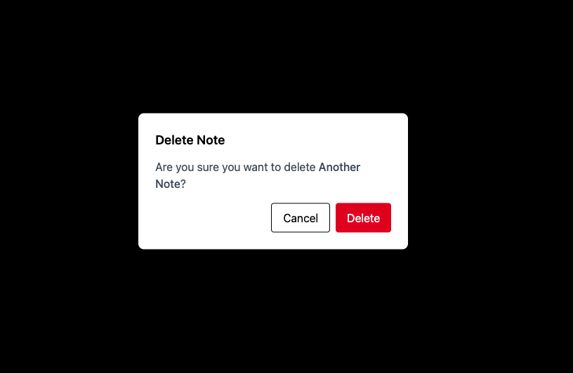

## Sample Notes Management App using react+vite and json mock server

#### Running the app
##### Backend
It uses a simple 
JSON server, execute following command 

```
cd backend 

npm install

npm start
```
The backend should be running on port 3001

##### Frontend
The frontend is built with react and vite. 

###### Configure backend port
The backend endpoint can be updated from ```src/constants``` file

```
export const BASE = 'http://localhost:3001'
```

Once the base url is configured, execute the following commands

```
cd frontend/notes-app

npm install

npm run dev // to run app in dev mode
```

To run the test cases run
```
npm run test
```
A sample test case is included for add note component

#### Library used
Tailwind CSS – Used as the primary CSS framework to maintain a consistent UI and speedup development.

Axios – Utilized for API communication, with the option to extend functionality using interceptors.

Redux – For managing notes CRUD state, while React Context is used for simpler global states (e.g., displaying toast notifications in this app).

UUID – Generates unique random IDs.


#### Sidenote

Filtering is performed on the UI side rather than on the backend.

Implements optimistic delete operation and notifies the user if the operation fails.

State Management & Utilities – The state, store, and utility functions can be reused and shared across React Native apps.

#### Screenshots



